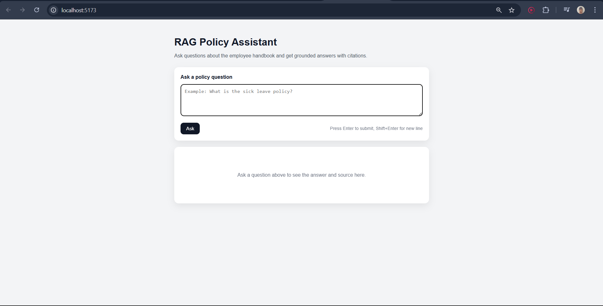
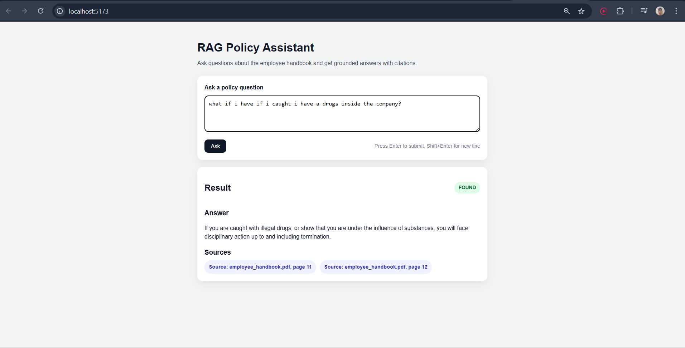
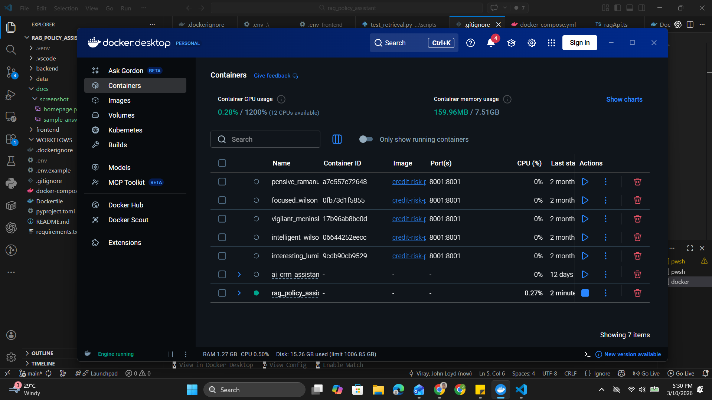
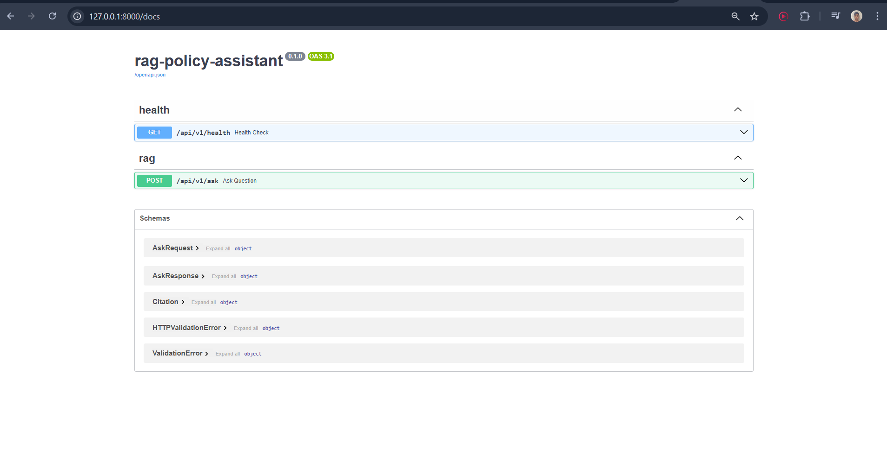

# RAG Policy Assistant

A full-stack Retrieval-Augmented Generation (RAG) application built from scratch with **FastAPI**, **React**, **OpenAI embeddings**, and **ChromaDB**. It answers policy questions using the **Workable Employee Handbook PDF** as the knowledge source and returns grounded answers with citations.

## Project Goal

Build a production-style RAG API that:

* retrieves relevant chunks from a policy handbook,
* generates answers grounded in retrieved context,
* returns a verdict of `FOUND` or `NOT_FOUND`,
* includes citations with `doc_name` and `page_number`.

This project is part of a portfolio series focused on building practical AI engineering projects from scratch.

## Features

* **FastAPI backend** with versioned routes
* **React frontend** for asking policy questions in a simple UI
* **PDF ingestion pipeline**
* **Page extraction and cleaning**
* **Chunking for retrieval**
* **OpenAI embeddings** for semantic search
* **Chroma persistent vector database**
* **RAG question-answering endpoint**
* **Structured JSON responses**
* **Citations** for answer traceability
* **Dockerized setup** with `docker compose`
* **Evaluation runner** with report output
* **Basic observability and logging**
* **Reliability controls** through environment variables

## Tech Stack

* **Frontend:** React, TypeScript, Vite
* **Backend:** FastAPI, Uvicorn
* **LLM / Embeddings:** OpenAI API
* **Vector Store:** ChromaDB
* **Data Processing:** Python JSONL pipeline
* **Containerization:** Docker, Docker Compose
* **Evaluation / Observability:** Custom evaluation runner + application logging

## Dataset

* **Source:** Workable Employee Handbook PDF
* **File:** `data/raw/employee_handbook.pdf`

The handbook is processed into pages, cleaned text, chunks, embeddings, and a persistent Chroma index.

## How It Works

### 1. Ingestion Pipeline

The PDF is converted into intermediate JSONL files:

* `data/processed/pages.jsonl`
* `data/processed/pages_clean.jsonl`
* `data/processed/chunks.jsonl`

### 2. Embedding and Indexing

Each chunk is embedded using OpenAI embeddings and stored in a persistent Chroma database:

* `data/indexes/chroma/`

### 3. Retrieval and Generation

When a user asks a question:

1. The API embeds the question.
2. Chroma retrieves the most relevant chunks.
3. Retrieved context is passed to the LLM.
4. The LLM generates a grounded answer.
5. The API returns:

   * `verdict`
   * `answer`
   * `citations`

### 4. Reliability Layer

The system includes:

* distance-based filtering,
* retry controls,
* context-size limits,
* citation fallback when the LLM fails to return valid citations.

## API Endpoints

### Health Check

**GET** `/api/v1/health`

Response:

```json
{
  "status": "ok"
}
```

### Ask a Policy Question

**POST** `/api/v1/ask`

Request body:

```json
{
  "question": "What is the sick leave policy?"
}
```

Example response:

```json
{
  "verdict": "FOUND",
  "answer": "We offer one week of paid sick leave. In states or countries where employees are entitled to more paid sick leave, local laws will apply.",
  "citations": [
    {
      "doc_name": "employee_handbook.pdf",
      "page_number": 28
    }
  ]
}
```

## Project Structure

```text
rag_policy_assistant/
├── app/
│   ├── api/
│   ├── core/
│   ├── services/
│   ├── schemas/
│   └── main.py
├── data/
│   ├── raw/
│   │   └── employee_handbook.pdf
│   ├── processed/
│   │   ├── pages.jsonl
│   │   ├── pages_clean.jsonl
│   │   └── chunks.jsonl
│   └── indexes/
│       └── chroma/
├── scripts/
├── data/eval/
│   └── report.json
├── docker-compose.yml
├── Dockerfile
├── requirements.txt
└── README.md
```

## Processing Pipeline

1. Place the handbook PDF in `data/raw/employee_handbook.pdf`
2. Extract pages into `pages.jsonl`
3. Clean extracted text into `pages_clean.jsonl`
4. Chunk the cleaned pages into `chunks.jsonl`
5. Embed chunks and store them in Chroma
6. Run the FastAPI app
7. Query the `/api/v1/ask` endpoint

## Environment Variables

Example `.env` values:

```env
OPENAI_API_KEY=your_openai_api_key
DISTANCE_THRESHOLD=0.35
MAX_CONTEXT_CHARS=4000
LLM_RETRY_COUNT=2
```

### What these control

* **DISTANCE_THRESHOLD**: filters out weak retrieval matches
* **MAX_CONTEXT_CHARS**: limits how much retrieved text is sent to the LLM
* **LLM_RETRY_COUNT**: retries answer generation when needed

## Local Setup

### 1. Clone the repository

```bash
git clone <your-repo-url>
cd rag_policy_assistant
```

### 2. Create and activate a virtual environment

```bash
python -m venv .venv
```

**Windows PowerShell**

```powershell
.\.venv\Scripts\Activate.ps1
```

**macOS / Linux**

```bash
source .venv/bin/activate
```

### 3. Install dependencies

```bash
pip install -r requirements.txt
```

### 4. Create `.env`

```env
OPENAI_API_KEY=your_openai_api_key
DISTANCE_THRESHOLD=0.35
MAX_CONTEXT_CHARS=4000
LLM_RETRY_COUNT=2
```

### 5. Run the API

```bash
uvicorn app.main:app --reload
```

### 6. Open Swagger UI

```text
http://127.0.0.1:8000/docs
```

## Docker Setup

Build and run:

```bash
docker compose up --build
```

Verify health:

```text
http://127.0.0.1:8000/api/v1/health
```

## Testing the API

### PowerShell example

```powershell
$body = @{ question = "What is the sick leave policy?" } | ConvertTo-Json
Invoke-RestMethod -Uri "http://127.0.0.1:8000/api/v1/ask" -Method Post -ContentType "application/json" -Body $body
```

### cURL example

```bash
curl -X POST "http://127.0.0.1:8000/api/v1/ask" \
  -H "Content-Type: application/json" \
  -d '{"question":"What is the sick leave policy?"}'
```

## Evaluation

The project includes an evaluation runner that generates:

* `data/eval/report.json`

This report can be used to summarize:

* successful answer coverage,
* verdict quality,
* citation behavior,
* reliability of retrieval + generation.

### Suggested metrics to show in portfolio

* Number of evaluation questions
* `FOUND` vs `NOT_FOUND` distribution
* Citation success rate
* Cases improved by citation fallback
* Example grounded answers

## Reliability and Observability

### Reliability features

* retrieval distance threshold
* context length control
* LLM retry count
* citation fallback logic

### Important fix implemented

Previously, some valid answers could return `NOT_FOUND` if the LLM answer was correct but citations were missing or malformed. A citation fallback was added so the API now reuses retrieved page metadata when needed. This fixed the sick leave policy example returning `NOT_FOUND` incorrectly.

### Logging

The app logs:

* retrieval pages,
* retrieval distances,
* final verdict,
* final citations.

## Known Issues and Lessons Learned

* **PowerShell vs cURL quoting** can cause confusing POST request failures on Windows.
* The correct processed chunk file is **`chunks.jsonl`** and not `chunk.jsonl`.
* A `401` OpenAI error was previously caused by an invalid API key and was fixed by updating the key and restarting the server.
* The evaluation script must point to a running API and must explicitly write `report.json`.

## Architecture Diagram

Add a diagram like this to the repository screenshots or README:

```text
User Question
    ↓
FastAPI /api/v1/ask
    ↓
Embed Question
    ↓
Chroma Retrieval
    ↓
Top Matching Chunks
    ↓
LLM Grounded Generation
    ↓
Verdict + Answer + Citations
```

## Portfolio Value

This project demonstrates:

* RAG pipeline design from scratch
* backend API engineering with FastAPI
* vector search with embeddings
* grounded answer generation
* reliability fixes for real-world edge cases
* Docker packaging and local deployment
* evaluation and observability mindset

## Screenshots

### Homepage


### Sample Answer


### Docker Running


### Swagger UI


## Current Scope

This project now has a **working frontend and backend**.

* **Frontend:** React app for entering questions and viewing verdicts, answers, and citations
* **Backend:** FastAPI RAG API
* **Testing:** Swagger UI, browser UI, PowerShell or cURL requests, Docker local run

## Screenshots to Add

Add these images to improve the portfolio:

* Frontend homepage
* Frontend successful `FOUND` response
* Swagger UI for `/api/v1/ask`
* Docker container or backend terminal running successfully
* Folder structure screenshot
* Evaluation report snippet
* Architecture diagram image

## Roadmap

### Completed

* API bootstrapped
* PDF ingestion pipeline
* chunking pipeline
* embeddings + Chroma index
* RAG endpoint
* evaluation support
* logging
* Docker packaging
* citation fallback fix

### Next Improvements

* hybrid search
* reranking
* multi-document support
* auth and roles
* simple frontend UI

## Resume / Portfolio Summary

Built a full-stack RAG Policy Assistant using React, FastAPI, OpenAI embeddings, and ChromaDB to answer employee handbook questions with grounded responses and page-level citations. Implemented PDF ingestion, chunking, semantic retrieval, reliability controls, logging, evaluation reporting, Docker packaging, and a simple UI for interactive querying.

## License

Add your preferred license here.
